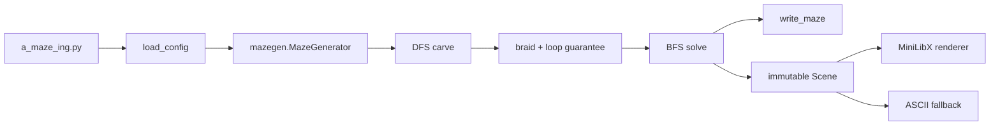

*This project has been created as part of the 42 curriculum by ksener, yukasaca.*

# A-Maze-ing

A-Maze-ing, bir yapılandırma dosyasından perfect veya non-perfect labirent
üreten, en kısa çözüm yolunu bulan, sonucu subject formatında kaydeden ve
Ubuntu üzerinde MiniLibX ya da terminal aracılığıyla gösteren Python
projesidir.

Bu belge iki amaçla yazılmıştır:

1. Projeyi temiz bir Ubuntu ortamında kurup çalıştırmak.
2. 42 evaluation sırasında kodu dosya, fonksiyon ve önemli kod bloğu
   seviyesinde teknik mülakat biçiminde anlatabilmek.

## İçindekiler

- [Özellikler](#özellikler)
- [Hızlı başlangıç](#hızlı-başlangıç)
- [Makefile hedefleri](#makefile-hedefleri)
- [Yapılandırma dosyası](#yapılandırma-dosyası)
- [Çıktı formatı](#çıktı-formatı)
- [Mimari](#mimari)
- [Labirent veri modeli](#labirent-veri-modeli)
- [Üretim algoritması](#üretim-algoritması)
- [Çözüm algoritması](#çözüm-algoritması)
- [42 deseni](#42-deseni)
- [Görselleştirme](#görselleştirme)
- [mazegen paketinin kullanımı](#mazegen-paketinin-kullanımı)
- [Dosya ve fonksiyon rehberi](#dosya-ve-fonksiyon-rehberi)
- [Önemli kod blokları](#önemli-kod-blokları)
- [Alternatifler ve tradeoff'lar](#alternatifler-ve-tradeofflar)
- [Hata yönetimi](#hata-yönetimi)
- [Test stratejisi](#test-stratejisi)
- [Evaluation anlatım planı](#evaluation-anlatım-planı)
- [Ekip çalışması](#ekip-çalışması)
- [Kaynaklar ve AI kullanımı](#kaynaklar-ve-ai-kullanımı)
- [Lisans](#lisans)

## Özellikler

- Python 3.10 ve üzeriyle çalışır.
- Seed verilirse aynı girdiden aynı labirenti üretir.
- Aynı `MazeGenerator` nesnesi tekrar kullanılabilir; her üretimde iç durum
  sıfırlanır.
- Perfect modda tüm normal hücreleri kapsayan bir spanning tree üretir.
- Varsayılan non-perfect modda en az iki bağımsız döngüyü garanti eder.
- Non-perfect modda dead-end hücreleri azaltmak için iki geçişli braiding
  uygular.
- Tamamen açık 3×3 alan oluşmasını engeller.
- Yeterli alan varsa `42` desenini `0xF`, yani dört duvarı da kapalı
  hücrelerle oluşturur.
- BFS ile girişten çıkışa en kısa yolu bulur.
- Hex duvar satırları ve `N/E/S/W` çözüm yönleriyle subject çıktısı üretir.
- Ubuntu x86_64 için verilen MiniLibX wheel'ini otomatik kurar.
- Grafik ekranı açılamazsa üretilen labirenti kaybetmeden terminal görünümüne
  geçer.
- `mazegen` bağımsız wheel olarak build ve install edilebilir.
- Flake8, mypy ve pytest kontrolleri Makefile üzerinden çalışır.

## Hızlı başlangıç

### Gereksinimler

Hedef ortam Ubuntu x86_64'tür. Python ve MiniLibX'in kullandığı sistem
kütüphaneleri Ubuntu imajında bulunmalıdır:

```bash
sudo apt-get update
sudo apt-get install -y \
    python3 python3-venv make \
    libxcb1 libxcb-keysyms1 libvulkan1 zlib1g libbsd0
```

> `make install`, repoda verilen `packages/mlx-2.2.tgz` içindeki Ubuntu
> Python wheel'ini otomatik çıkarır ve `.venv` içine kurar. Yukarıdaki APT
> paketleri işletim sistemi seviyesindeki shared library'lerdir; Makefile
> root yetkisi istememek için bunları habersizce kurmaz.

### Kurulum

```bash
make install
```

Bu tek komut:

1. Python sürümünün en az 3.10 olduğunu kontrol eder.
2. Yoksa `.venv` sanal ortamını oluşturur.
3. pip, setuptools ve wheel araçlarını hazırlar.
4. `requirements.txt` bağımlılıklarını kurar.
5. `mazegen` paketini src layout'tan kurar.
6. Bundled Ubuntu MiniLibX wheel'ini çıkarır ve kurar.
7. Gerçek `from mlx import Mlx` kontrolü yapar.

### Çalıştırma

```bash
make run
```

Farklı bir config kullanmak için:

```bash
make run CONFIG=examples/my_config.txt
```

Programın doğrudan CLI sözleşmesi tam olarak bir config argümanıdır:

```bash
.venv/bin/python a_maze_ing.py packages/configuration/config.txt
```

Yanlış argüman sayısı usage mesajı ve exit code `1` üretir.

## Makefile hedefleri

| Hedef | Görevi |
|---|---|
| `make install` | Sanal ortam, Python bağımlılıkları, `mazegen` ve Ubuntu MLX kurulumu |
| `make install-core` | MLX olmadan Python araçları ve `mazegen` kurulumu |
| `make install-mlx` | Bundled Ubuntu MLX wheel'ini yeniden kurma ve import kontrolü |
| `make run` | Kurulumu tamamlayıp seçili config ile programı çalıştırma |
| `make debug` | Aynı programı Python `pdb` altında çalıştırma |
| `make lint` | Subject'in istediği Flake8 ve mypy komutlarını çalıştırma |
| `make lint-strict` | Flake8 ve `mypy --strict` çalıştırma |
| `make test` | Pytest test paketini çalıştırma |
| `make package` | Repo kökünde `mazegen-*.whl` üretme |
| `make clean` | Cache ve geçici build dosyalarını silme; teslim wheel'ini koruma |
| `make help` | Hedeflerin kısa açıklamasını yazdırma |

Kurulum hedefleri stamp dosyaları kullanır:

- `.venv/.core-installed`
- `.venv/.mlx-installed`

`requirements.txt`, `pyproject.toml` veya mazegen kaynakları değiştiğinde
Make prerequisite zinciri core kurulumu yeniden çalıştırır. MLX arşivi
değiştiğinde MLX kurulumu tekrar edilir.

## Yapılandırma dosyası

Format her satırda bir `KEY=VALUE` çiftidir. Boş satırlar ve ilk anlamlı
karakteri `#` olan satırlar yok sayılır. Key'ler büyük/küçük harfe duyarsız,
değerlerin çevresindeki boşluklar temizlenir.

Altı zorunlu key vardır:

| Key | Tip | Anlamı |
|---|---|---|
| `WIDTH` | integer, 2..500 | Sütun sayısı |
| `HEIGHT` | integer, 2..500 | Satır sayısı |
| `ENTRY` | `x,y` | Başlangıç hücresi |
| `EXIT` | `x,y` | Bitiş hücresi |
| `OUTPUT_FILE` | path | Labirent çıktısının yazılacağı dosya |
| `PERFECT` | boolean | Perfect veya non-perfect üretim |

`SEED` opsiyoneldir. Seed yoksa her process çalıştırmasında farklı bir
labirent üretilir.

Boolean değerler:

- True: `true`, `yes`, `on`, `1`
- False: `false`, `no`, `off`, `0`

Varsayılan config:

```ini
WIDTH=20
HEIGHT=15
ENTRY=0,0
EXIT=19,14
OUTPUT_FILE=maze.txt
PERFECT=False
SEED=42
```

Koordinatlar `(x, y)` sırasındadır:

- `x`: sütun, `0 <= x < WIDTH`
- `y`: satır, `0 <= y < HEIGHT`
- Grid erişimi: `grid[y][x]`

`ENTRY` ve `EXIT` aynı olamaz. Non-perfect 2×2 labirent matematiksel olarak
iki bağımsız döngü taşıyamadığı için generator açık bir hata verir.

## Çıktı formatı

Önce her hücre için tek bir büyük hexadecimal karakter yazılır. Bir satır bir
grid satırıdır. Ardından boş satır, giriş, çıkış ve çözüm yönleri gelir:

```text
9D3
A96
C57

0,0
2,2
ESSE
```

Son üç satırın anlamı:

1. Entry: `x,y`
2. Exit: `x,y`
3. En kısa yol: yalnız `N`, `E`, `S`, `W`

### Duvar bitleri

Her set bit kapalı bir duvar demektir:

| Bit | Decimal | Yön |
|---:|---:|---|
| `0001` | 1 | North |
| `0010` | 2 | East |
| `0100` | 4 | South |
| `1000` | 8 | West |

Örnekler:

| Hex | Decimal | Kapalı duvarlar |
|---|---:|---|
| `0` | 0 | Hiçbiri |
| `3` | 3 | North + East |
| `5` | 5 | North + South |
| `A` | 10 | East + West |
| `F` | 15 | Dört duvarın tamamı |

## Mimari



Katman sınırları:

- **Configuration:** metni typed ve doğrulanmış `MazeConfig` nesnesine çevirir.
- **Reusable domain:** `mazegen` yalnız labirent üretir ve çözer.
- **Application orchestration:** config, generator, writer ve display'i bağlar.
- **Presentation model:** renderer'lardan bağımsız immutable `Scene`.
- **Renderers:** aynı Scene'i MiniLibX veya ANSI terminal için çizer.

Bu ayrım sayesinde `mazegen` paketini A-Maze-ing CLI olmadan başka projelerde
kullanmak mümkündür.

### Dizin yapısı

```text
.
├── a_maze_ing.py
├── errors.py
├── Makefile
├── requirements.txt
├── LICENSE.md
├── README.md
├── mypy.ini
├── packages/
│   ├── configuration/
│   │   ├── config.py
│   │   └── config.txt
│   ├── display/
│   │   └── render_mlx.py
│   ├── presentation/
│   │   ├── view.py
│   │   ├── writer.py
│   │   └── render_ascii.py
│   ├── mazegen/
│   │   ├── pyproject.toml
│   │   ├── README.md
│   │   ├── LICENSE.md
│   │   └── src/mazegen/
│   │       ├── __init__.py
│   │       ├── generator.py
│   │       ├── pattern_generator.py
│   │       └── solve.py
│   └── mlx-2.2.tgz
└── tests/
```

## Labirent veri modeli

Grid bir `list[list[int]]` yapısıdır:

```python
grid[y][x]
```

Başlangıçta her hücre:

```python
ALL_WALLS = NORTH | EAST | SOUTH | WEST  # 15 / 0xF
```

Bir duvar açılırken iki hücre birlikte güncellenir. Örneğin `(x, y)`
hücresinin East duvarı açılırsa doğu komşusunun West duvarı da açılır. Bu
simetri şu invariant'ı korur:

```text
current.EAST açık <=> east_neighbour.WEST açık
```

Pattern hücreleri passage graph'a dahil edilmez ve hep `0xF` kalır.

## Üretim algoritması

### 1. Validation

Constructor aşağıdakileri reddeder:

- `WIDTH < 2` veya `HEIGHT < 2`
- Grid dışında entry/exit
- Aynı entry ve exit

Hata yazdırılıp devam edilmez; `MazeError` yükseltilir. Böylece yarı-geçerli
bir generator nesnesi oluşmaz.

### 2. Reset

Her `generate()` çağrısı:

- RNG'yi aynı seed ile yeniden kurar.
- Bütün hücreleri `0xF` durumuna döndürür.
- `42` pattern konumunu yeniden hesaplar.

Bu yüzden aynı seeded nesnenin ikinci çağrısı ilk çağrıyla aynı sonucu verir.

### 3. Iterative randomized DFS

`_carve()`, entry'den başlayarak iterative depth-first search uygular:

1. Stack'in son hücresine bakar.
2. Grid içinde, ziyaret edilmemiş ve pattern olmayan komşuları toplar.
3. Seeded RNG ile bir komşu seçer.
4. İki taraflı duvarı açar.
5. Komşuyu visited ve stack'e ekler.
6. Seçenek kalmadığında stack'ten geri çıkar.

DFS sonunda normal passage graph connected bir spanning tree'dir.

Perfect mod burada biter. Connected bir tree için:

```text
E = V - 1
cycle_rank = E - V + 1 = 0
```

Yani her iki hücre arasında tek basit yol vardır.

### 4. Non-perfect braiding

`_braid()` iki kez tüm normal hücreleri dolaşır. Derecesi bir olan, yani
dead-end hücrelerde kapalı komşu duvarlardan birini açmayı dener.

Duvar şu koşullarda açılır:

- Komşu grid içindedir.
- Komşu pattern değildir.
- Duvar gerçekten kapalıdır.
- Açma işlemi tamamen açık 3×3 alan üretmez.

İki pass kullanmak, ilk pass'teki değişikliklerden sonra hâlâ degree 1 kalan
hücrelere ikinci şans verir.

### 5. En az iki bağımsız loop garantisi

Braiding kaliteli sonuç üretse bile tek başına matematiksel postcondition
değildir. Bu nedenle `_ensure_minimum_loops(2)` graph'ın cycle rank'ını
hesaplar.

```text
cycle_rank = open_edges - normal_vertices + 1
```

Değer ikiden küçükse her internal kapalı duvar bir kez aday olur. Aday 3×3
kuralını bozmuyorsa açılır. İki loop sağlanınca işlem durur. Geometri bunu
sağlayamıyorsa yanlış bir maze döndürmek yerine `MazeError` yükseltilir.

### 6. 3×3 açık alan koruması

`_creates_open_area()` transactional bir kontrol yapar:

1. Aday duvarı geçici açar.
2. Etkilenen iki hücrenin çevresindeki olası 3×3 pencereleri kontrol eder.
3. Duvarı tekrar kapatır.
4. Sonucu boolean olarak döndürür.

Gerçek açma yalnız sonuç güvenliyse yapılır. Bu yaklaşım, olası sonucu bit
maskeleri üzerinden doğrudan simüle ettiği için karmaşık tahmin kurallarından
daha kolay doğrulanır.

### Karmaşıklık

`V = WIDTH * HEIGHT - pattern_cells`, `E` olası komşuluk sayısı olsun.

- DFS generation: `O(V + E)`
- Braiding: `O(V)`
- İki-loop guarantee: pratikte `O(V + E)`
- Grid ve visited/stack memory: `O(V)`

Recursive DFS kullanılmamasının nedeni büyük grid'lerde Python recursion
limitine takılmamaktır.

### 500×500 referans ölçümü

Seed `42` ile geliştirme makinesinde yapılan ölçüm:

| Mod | Generate | Solve | Path hücresi | Cycle rank |
|---|---:|---:|---:|---:|
| Perfect | 0.493 s | 0.017 s | 15.225 | 0 |
| Non-perfect | 1.203 s | 0.126 s | 1.409 | 24.951 |

Süreler donanıma göre değişir; bu ölçüm recursive stack overflow olmadığını ve
deque + parent map solver'ın büyük grid'de lineer davranışını kontrol etmek
içindir.

## Çözüm algoritması

`solve_grid()` breadth-first search kullanır:

- Queue: `collections.deque`
- Ziyaret bilgisi: `parents` map
- Her hücre queue'ya en fazla bir kez girer.
- Exit bulunduğunda parent bağlantıları geriye takip edilir.
- Path ters çevrilerek entry → exit sırası elde edilir.

BFS unweighted grid graph'ta en kısa kenar sayılı yolu garanti eder.

Eski yaklaşımda queue başından `list.pop(0)` ve her komşu için tüm path
kopyası kullanılabilirdi. Deque + parent map:

- Queue başından `O(1)` çıkarma yapar.
- Her node için bütün path'i kopyalamaz.
- Time complexity'yi `O(V + E)`, memory'yi `O(V)` tutar.

Çözüm yoksa package boş listeyi geçerli sonuç gibi sunmaz; public
`MazeGenerator.solve()` bir `MazeError` yükseltir.

## 42 deseni

Pattern iki 3×5 bitmap'ten oluşur ve aralarında bir sütun boşluk vardır:

```text
X.X  XXX
X.X  ..X
XXX  XXX
..X  X..
..X  XXX
```

`X` olan toplam 20 hücre `0xF` kalır.

Yerleştirme:

1. Grid en az 9×7 değilse pattern uygulanmaz.
2. En merkeze yakın satır ve sütun adayları sıralanır.
3. Entry, exit veya korunan merkez hücresiyle çakışan aday reddedilir.
4. İlk geçerli konum seçilir.

Sadece tek merkez konumunu denemek yerine hem yatay hem dikey aday araması
yapılması, fiziksel olarak yeterli grid'lerde pattern'in gereksiz yere
kaybolmasını engeller.

## Görselleştirme

### Ortak Scene

`Scene` immutable bir dataclass'tır ve iki renderer için aynı veriyi taşır:

- width/height
- grid
- entry/exit
- shortest path hücreleri
- pattern hücreleri
- perfect/non-perfect bilgisi

Renderer generator nesnesine bağlı değildir. Bu, UI state'i ile generation
state'inin birbirini bozmasını engeller.

### MiniLibX

`render_mlx.py`:

- Gerçek screen size üzerinden güvenli pencere budget'ı hesaplar.
- Pencere sığmıyorsa `mlx_new_window` çağrısından önce hata verir.
- Maze ve status alanının toplam yüksekliğini hesaba katar.
- Status satırlarını maze'in altında ayrılmış alana çizer.
- Her frame'i tek image buffer üzerinde hazırlar.
- Pixel formatına göre BGRA veya ARGB byte sırası üretir.
- Alpha kanalını `0xFF` kullanır.
- Klavye ve window-close hook'larını kaydeder.

Tuşlar:

| Tuş | İşlem |
|---|---|
| `1` | Yeni random maze üret |
| `2` | En kısa yolu göster/gizle |
| `3` | Theme değiştir |
| `4`, `Q`, `Esc` | Çık |

### Terminal fallback

MiniLibX importu, init, screen veya window işlemleri başarısız olursa:

1. Hata stderr'e yazılır.
2. Aynı `Scene` terminal renderer'a verilir.
3. Menü üzerinden regenerate/path/theme/quit davranışı korunur.

Terminal renderer iki canvas satırını `▀` karakterinde foreground/background
renkleriyle birleştirir. Terminal karakterleri genellikle yüksek olduğu için bu
yöntem maze oranını daha kare gösterir.

## mazegen paketinin kullanımı

`make package` sonrası repo kökünde oluşan wheel:

```bash
python3 -m venv consumer-env
consumer-env/bin/python -m pip install mazegen-0.1.0-py3-none-any.whl
```

Public API:

```python
from mazegen import MazeError, MazeGenerator

try:
    maze = MazeGenerator(
        width=20,
        height=15,
        entry=(0, 0),
        exit=(19, 14),
        perfect=False,
        seed=42,
    )
    grid = maze.generate()
    path = maze.solve()
    directions = MazeGenerator.coords_to_letters(path)
except MazeError as error:
    print(f"Maze üretilemedi: {error}")
```

Public üyeler:

- `MazeGenerator`
- `MazeError`

Önemli properties:

- `maze.grid`: bitmask grid
- `maze.pattern_cells`: `frozenset[(x, y)]`
- `maze.pattern_applied`: pattern kullanıldı mı

Paket uygulamanın config, writer veya MLX modüllerini import etmez. Böylece
başka bir tüketici kendi config ve render katmanını seçebilir.

## Dosya ve fonksiyon rehberi

### `a_maze_ing.py`

#### `build_scene(config, seed)`

- Kurulu `mazegen` public API'sini import eder.
- Config değerlerini generator constructor'a geçirir.
- Generate ve solve işlemlerini yapar.
- Package `MazeError`ını application `AMazeIngError`ına çevirir.
- Subject output dosyasını yazar.
- Renderer-independent `Scene` üretir.

Bu fonksiyon generation ile presentation arasındaki orchestration boundary'dir.

#### `display(config, scene)`

- `regenerate()` closure'ı ile yeni seed üretir.
- Önce `MazeWindow` çalıştırır.
- Normal grafik exception'larında ASCII renderer'a geçer.
- `KeyboardInterrupt`, `Exception` değil `BaseException` olduğu için burada
  yanlışlıkla yutulmaz.

#### `main(argv)`

- Tam bir argüman kontrolü yapar.
- Config → Scene → success message → display akışını yönetir.
- Beklenen application hatalarını tek satır stderr ve exit code `1` yapar.
- Başarıda `0` döndürür.

### `errors.py`

- `AMazeIngError`: application beklenen hata base class'ı.
- `ConfigError`: config okuma, syntax ve semantic hataları.
- `OutputError`: serialization ve filesystem hataları.
- `RenderError`: MiniLibX/display hataları.

`mazegen.MazeError` ayrı tutulur; reusable package ana uygulamanın exception
hiyerarşisine bağımlı değildir.

### `packages/configuration/config.py`

#### `MazeConfig`

Frozen dataclass'tır. Parser yalnız bütün kontroller geçerse bu nesneyi döndürür.
Rest of application aynı değerleri tekrar parse etmez.

#### `_read_pairs(path)`

- UTF-8 dosyayı satır satır okur.
- Comment ve boş satırları atlar.
- `=` yoksa line-number içeren hata verir.
- Duplicate key'i reddeder.
- I/O exception'larını `ConfigError`a çevirir.

#### `_require(pairs, key)`

Mandatory key'in var ve boş olmadığını garanti eder.

#### `_to_int`, `_to_bool`, `_to_point`

String değerleri typed değerlere dönüştürür ve hatada hangi key'in bozuk
olduğunu mesajda belirtir.

#### `_check_side`, `_check_inside`

Boyut ve koordinat sınırlarını doğrular.

#### `load_config(path)`

Parse ve semantic validation sırasını tek public entry point'te birleştirir.
NUL içeren output path'i filesystem'e ulaşmadan reddeder.

### `packages/mazegen/src/mazegen/generator.py`

#### `MazeError`

Reusable package'in invalid input ve unsatisfied postcondition hatasıdır.

#### `MazeGenerator.__init__`

Parametreleri saklar, validation yapar ve ilk kapalı grid'i hazırlar. `perfect`
default değeri subject ile uyumlu biçimde `False`tur.

#### `_reset()`

RNG, grid ve pattern state'ini başlangıca getirir.

#### `_validate()`, `_validate_point()`

Public input contract'ını korur; hata yazdırıp devam etmez.

#### `_in_bounds()`, `_neighbour()`

Koordinat matematiğini tek yerde tutar.

#### `_open_wall()`, `_close_wall()`

İki komşunun karşılıklı bitlerini birlikte günceller.

#### `_open_cells()`

Pattern dışında kalan passage graph vertex listesini üretir.

#### `_carve()`

Iterative randomized DFS spanning tree üretir.

#### `generate()`

Reset → DFS → gerekiyorsa braid → minimum loop postcondition akışıdır.

#### `_cycle_rank()`

Açık East/South edge'lerini bir kez sayıp bağımsız cycle sayısını hesaplar.

#### `_closed_internal_walls()`

Her internal kapalı duvarı East/South yönleri üzerinden tam bir kez listeler ve
seeded RNG ile karıştırır.

#### `_ensure_minimum_loops(minimum)`

Güvenli duvarlar açarak cycle rank'ı minimum değere çıkarır; imkânsızsa hata
verir.

#### `_open_count()`

Bir hücrenin passage degree'sini hesaplar.

#### `_is_open_area()`, `_creates_open_area()`

3×3 tamamen açık alan postcondition'ını korur.

#### `_braid()`

Dead-end hücrelere güvenli alternatif bağlantılar ekler.

#### `coords_to_letters(path)`

Coordinate path'i output footer için yön string'ine çevirir.

#### `solve()`

`solve_grid` BFS helper'ını çağırır ve unreachable sonucu `MazeError` yapar.

### `packages/mazegen/src/mazegen/pattern_generator.py`

- `pattern_cells`: immutable pattern coordinate set'i.
- `pattern_applied`: pattern var/yok bilgisi.
- `_pattern_rows()`: merkeze yakın y adayları.
- `_pattern_columns()`: merkeze yakın x adayları.
- `_compute_pattern()`: entry/exit/center çakışmadan ilk geçerli aday.
- `_block_at()`: `FOUR_PATTERN` ve `TWO_PATTERN` bitmap'lerini coordinate
  set'e çevirir.

### `packages/mazegen/src/mazegen/solve.py`

`solve_grid(grid, entry, exit_)`, deque ve parent map kullanan typed BFS
helper'ıdır. Generator'dan bağımsız grid sözleşmesiyle çalışır.

### `packages/presentation/writer.py`

#### `format_maze()`

- Empty/ragged grid'i reddeder.
- Her cell'in 0..15 olduğunu kontrol eder.
- Büyük hexadecimal karakter kullanır.
- Path alphabet'ini `NESW` ile sınırlar.
- Tam dosya içeriğini string olarak döndürür.

Pure function olduğu için filesystem olmadan kolay test edilir.

#### `write_maze()`

Pure formatter çıktısını UTF-8 dosyaya yazar ve I/O exception'larını
`OutputError`a çevirir.

### `packages/presentation/view.py`

- `Theme`: RGB renk paleti.
- `THEMES`: classic, amber, matrix, ice.
- `ansi_bg()`, `ansi_fg()`: 24-bit terminal escape kodları.
- `Scene`: immutable renderer input'u.
- `Scene.cell_colour()`: entry/exit/pattern/path/floor önceliğini uygular.

### `packages/presentation/render_ascii.py`

- `corridor_colour()`: terminal için hücre rengi.
- `build_canvas()`: cell grid'i duvarları da içeren 2× çözünürlüklü canvas'a
  çevirir.
- `draw()`: iki satırı ANSI half-block karakterinde birleştirir.
- `run()`: interaktif terminal menüsü.

### `packages/display/render_mlx.py`

- `cell_size()`: budget'a sığan en büyük cell boyutu.
- `window_size()`: maze + duvar + status alanı.
- `window_budget()`: gerçek ekran marjlarını uygular.
- `_pixel()`: RGB rengini MLX buffer byte formatına çevirir.
- `Painter.rect()`: raw buffer'a clipped rectangle yazar.
- `paint_scene()`: bütün maze'i image buffer'a çizer.
- `MazeWindow.__init__()`: MLX, ekran, pencere, image ve hook kurulumu.
- `theme`: aktif theme property.
- `_draw_status()`: maze altındaki komut satırları.
- `_render()`, `_redraw()`: frame üretimi.
- `_next_theme()`: theme index rotation.
- `_on_key()`, `_on_expose()`, `_on_close()`: event callback'leri.
- `_close()`: image/window kaynaklarını bırakır.
- `_register_hooks()`: MLX callback kayıtları.
- `run()`: event loop.

## Önemli kod blokları

### Simetrik duvar açma

```python
self.grid[y][x] &= ~direction
self.grid[ny][nx] &= ~OPPOSITE[direction]
```

`&= ~direction` ilgili closed-wall bitini sıfırlar. İkinci satır komşunun
karşı yönünü sıfırladığı için graph tek taraflı passage içermez.

Alternatif olarak her edge ayrı nesne tutulabilirdi; bitmask yaklaşımı daha az
memory ve doğrudan hex serialization sağlar.

### Seeded ve tekrar kullanılabilir generate

```python
def generate(self) -> list[list[int]]:
    self._reset()
    self._carve()
    if not self.perfect:
        self._braid()
        self._ensure_minimum_loops(2)
    return self.grid
```

`_reset()` olmadan aynı nesnenin ikinci çağrısı eski açık duvarların üstüne
yeni yollar ekler ve perfect invariant'ını bozar. Reset bu state leak'i
engeller.

### Cycle postcondition

```python
return edges - len(cells) + 1
```

Connected undirected graph için cyclomatic number formülüdür. `>= 2`
kontrolü “muhtemelen loop vardır” yerine ölçülebilir bir guarantee verir.

### Parent map ile BFS

```python
parents: dict[Point, Point | None] = {entry: None}
queue = deque([entry])
```

Bir coordinate parent map'e eklendiği anda visited kabul edilir. Böylece aynı
hücre queue'ya birden çok kez girmez.

### Pure serialization

```python
text = format_maze(grid, config.entry, config.exit, path_letters)
with open(config.output_file, "w", encoding="utf-8") as stream:
    stream.write(text)
```

Formatlama ve I/O ayrımı, exact output'u filesystem yan etkisi olmadan test
etmeyi sağlar.

## Alternatifler ve tradeoff'lar

### DFS yerine Prim veya Kruskal

- **DFS seçimi:** basit, iterative, memory kontrollü, uzun koridorlu maze.
- **Randomized Prim:** daha çok kısa branch ve farklı görsel karakter.
- **Kruskal:** union-find gerekir; bütün edge listesini tutar.

Bu proje için DFS, 42 seviyesinde anlatılabilirlik ve deterministic seed
bakımından iyi dengedir.

### BFS yerine DFS veya A*

- **BFS:** unweighted grid'de en kısa yolu garanti eder.
- **DFS solver:** bir yol bulur fakat shortest guarantee vermez.
- **A\*:** büyük grid'de daha az node gezebilir fakat heuristic ve priority
  queue karmaşıklığı ekler.

Subject shortest route çıktısını kullandığı için BFS en doğrudan seçimdir.

### Bitmask yerine dört boolean

- Bitmask: tek integer, hızlı bit operation, output hex'e doğrudan dönüşüm.
- Dört boolean: yeni başlayan için daha okunur fakat serialization ve memory
  daha ağır.

### Exception yerine print

- Exception caller'a recovery/exit kararını bırakır.
- Print edip devam etmek invalid nesne ve daha sonra ilgisiz `IndexError`
  üretir.

Reusable package `MazeError`, application ise kendi hata hiyerarşisini
kullanır.

### Src layout yerine flat layout

- Src layout yanlışlıkla working-directory kaynağını import etmeyi engeller.
- Wheel'in gerçekten build/install edilmesini zorunlu kılar.
- Birden çok top-level module discovery hatasını ortadan kaldırır.

### Bundled MLX wheel yerine PyPI

`mlx` adı PyPI'da farklı projelerle çakışabilir. Subject tarafından verilen
Ubuntu artifact'ini kullanmak yanlış paketi kurma riskini kaldırır ve evaluation
sürümünü sabitler.

## Hata yönetimi

```text
mazegen.MazeError
        │ application boundary
        ▼
AMazeIngError
├── ConfigError
├── OutputError
└── RenderError
```

Kurallar:

- Beklenen user/config/domain hatası traceback üretmez.
- CLI tek okunabilir satır ve non-zero exit code verir.
- Exception mesajı problemli key, coordinate veya path'i içerir.
- Grafik hatası maze generation/output başarısını iptal etmez; ASCII fallback
  denenir.
- `KeyboardInterrupt` exit code `130` ile ayrıdır.

## Test stratejisi

```bash
make test
```

Test grupları:

- Package wheel build/install/public import ve metadata
- Generator validation ve default mode
- Seed determinism ve repeated generation
- Passage symmetry ve closed boundaries
- Perfect connectivity ve cycle rank 0
- Non-perfect connectivity ve cycle rank ≥2
- 3×3 tamamen açık alan yasağı
- 2×2 impossible non-perfect rejection
- 42 pattern relocation ve `0xF` koruması
- BFS path continuity ve unreachable error
- Config syntax/semantic/NUL path/default config
- Exact uppercase output ve invalid grid rejection
- CLI exit code, output creation ve traceback absence
- MLX oversize, status placement, initialization ve fallback
- Makefile venv bootstrap, Ubuntu MLX extraction, dependency chain ve clean

Lint:

```bash
make lint
```

Çalışan subject komutları:

```bash
flake8 .
mypy . \
    --warn-return-any \
    --warn-unused-ignores \
    --ignore-missing-imports \
    --disallow-untyped-defs \
    --check-untyped-defs
```

Wheel:

```bash
make package
python3 -m venv /tmp/mazegen-consumer
/tmp/mazegen-consumer/bin/python -m pip install \
    mazegen-0.1.0-py3-none-any.whl
/tmp/mazegen-consumer/bin/python -c \
    'from mazegen import MazeError, MazeGenerator; print(MazeGenerator)'
```

## Evaluation anlatım planı

### Yazılımcı 1: Sözleşme, config, output ve hata yönetimi

Önerilen sıra:

1. CLI neden tek config argümanı alıyor?
2. `load_config` neden tam doğrulanmış frozen dataclass döndürüyor?
3. `grid[y][x]` ile public `(x, y)` farkı nedir?
4. Bitmask → uppercase hex output nasıl oluşuyor?
5. Package ve application exception'ları neden ayrı?

Ana dosyalar:

- `a_maze_ing.py`
- `errors.py`
- `packages/configuration/config.py`
- `packages/presentation/writer.py`

### Yazılımcı 2: Generator, pattern ve solver

Önerilen sıra:

1. Dört duvar bitmask ile nasıl tutuluyor?
2. DFS spanning tree neden perfect maze oluşturuyor?
3. İki taraflı wall symmetry nasıl korunuyor?
4. Braiding ve cycle rank guarantee farkı nedir?
5. 3×3 kontrolü neden duvarı geçici açıp kapatıyor?
6. 42 pattern graph'tan nasıl izole ediliyor?
7. Deque + parent map BFS neden shortest path veriyor?

Ana dosyalar:

- `generator.py`
- `pattern_generator.py`
- `solve.py`

### Yazılımcı 3: Renderer, paketleme, Makefile ve testler

Önerilen sıra:

1. Immutable Scene neden iki renderer arasında boundary?
2. MLX window budget ve image buffer nasıl çalışıyor?
3. Grafik yoksa ASCII fallback nasıl devreye giriyor?
4. Src layout neden wheel build problemini çözüyor?
5. `make install` fresh checkout'ta hangi sırayı izliyor?
6. Hangi test hangi subject invariant'ını ispatlıyor?

Ana dosyalar:

- `packages/presentation/view.py`
- `packages/presentation/render_ascii.py`
- `packages/display/render_mlx.py`
- `packages/mazegen/pyproject.toml`
- `Makefile`
- `tests/`

### Sık evaluation soruları

**Perfect ve non-perfect arasındaki graph farkı nedir?**

Perfect connected tree'dir ve cycle rank 0'dır. Non-perfect aynı connected
graph'a güvenli ekstra edge'ler ekler ve cycle rank en az 2 olur.

**Neden sadece braid yeterli değil?**

Braid bir kalite heuristic'idir. Bazı küçük seed/geometrilerde yalnız bir loop
oluşturabilir. Cycle rank ölçümü global postcondition sağlar.

**Neden bir hücrenin duvarını tek taraflı açmıyoruz?**

Grid undirected graph'tır. Tek taraflı bit değişimi writer, solver ve renderer
arasında çelişki oluşturur.

**Neden BFS?**

Tüm passage edge'lerinin ağırlığı eşittir; BFS ilk ulaştığı exit path'inin en
kısa olduğunu garanti eder.

**Seed determinism nasıl korunuyor?**

Global `random` yerine generator'a ait `Random(seed)` kullanılır ve her
`generate()` başında yeniden kurulur.

**MLX yoksa proje başarısız mı sayılır?**

Hayır. Maze önce üretilip dosyaya yazılır. Grafik boundary hata verirse aynı
Scene terminalde gösterilir.

## Ekip çalışması

Git geçmişindeki sorumluluk ayrımına göre:

- **ksener:** maze generator çekirdeği, wall işlemleri, pattern üretimi,
  non-perfect algoritma, solver, Makefile ve package yapısı.
- **yukasaca:** config parser, error hierarchy, output writer, Scene modeli,
  ASCII/MLX sunum katmanları ve uygulama entegrasyonu.
- **Ortak:** subject gereksinim kontrolü, edge-case testleri, package/build
  doğrulaması, README ve evaluation hazırlığı.

Önerilen çalışma biçimi:

1. Her görev observable bir davranış veya subject maddesine bağlanır.
2. Değişiklikten önce regression/invariant testi yazılır.
3. Test beklenen nedenle kırmızı görülür.
4. En küçük düzeltme yapılır.
5. İlgili test, tüm test suite ve lint yeniden çalıştırılır.
6. Retrospective'te yalnız “ne yaptık” değil, hangi invariant'ın daha önce
   eksik olduğu ve tekrarını hangi testin engellediği konuşulur.

Kullanılan araçlar:

- Git: değişiklik geçmişi ve sorumluluk takibi
- Make: tek komutlu reproducible workflow
- pytest: behavior ve invariant testleri
- Flake8: Python style/norm
- mypy: type boundary kontrolleri
- build/setuptools: wheel üretimi
- MiniLibX: Ubuntu grafik katmanı

## Kaynaklar ve AI kullanımı

Başvurulan teknik kaynaklar:

- 42 A-Maze-ing subject v2.2
- [Python random.Random](https://docs.python.org/3/library/random.html#random.Random)
- [Python collections.deque](https://docs.python.org/3/library/collections.html#collections.deque)
- [Python packaging: pyproject.toml](https://packaging.python.org/en/latest/guides/writing-pyproject-toml/)
- [setuptools src layout](https://setuptools.pypa.io/en/latest/userguide/package_discovery.html#src-layout)
- [pytest documentation](https://docs.pytest.org/)
- [Flake8 documentation](https://flake8.pycqa.org/)
- [mypy documentation](https://mypy.readthedocs.io/)
- Bundled MiniLibX 2.2 README, headers ve man sayfaları
- [MIT License](https://opensource.org/license/mit)

AI araçları şu amaçlarla kullanıldı:

- Subject maddelerini traceability checklist'e dönüştürme
- Mevcut kodda package/build, edge-case ve hata akışı incelemesi
- Failing test senaryolarını ve graph invariant kontrollerini taslaklama
- Makefile ve `pyproject.toml` paketleme hatalarını teşhis etme
- Teknik dokümantasyonun ilk taslağını hazırlama

AI çıktıları doğrudan doğru kabul edilmedi. Davranışlar pytest, Flake8, mypy,
wheel build/install, gerçek CLI komutları ve Ubuntu kurulum akışıyla
doğrulanmıştır. Evaluation sırasında ekip üyelerinin teslim edilen her kod
satırını açıklayabilmesi sorumluluğu korunur.

## Lisans

Bu proje MIT lisansı ile sunulur. Ayrıntılar için [LICENSE.md](LICENSE.md)
dosyasına bakın.
